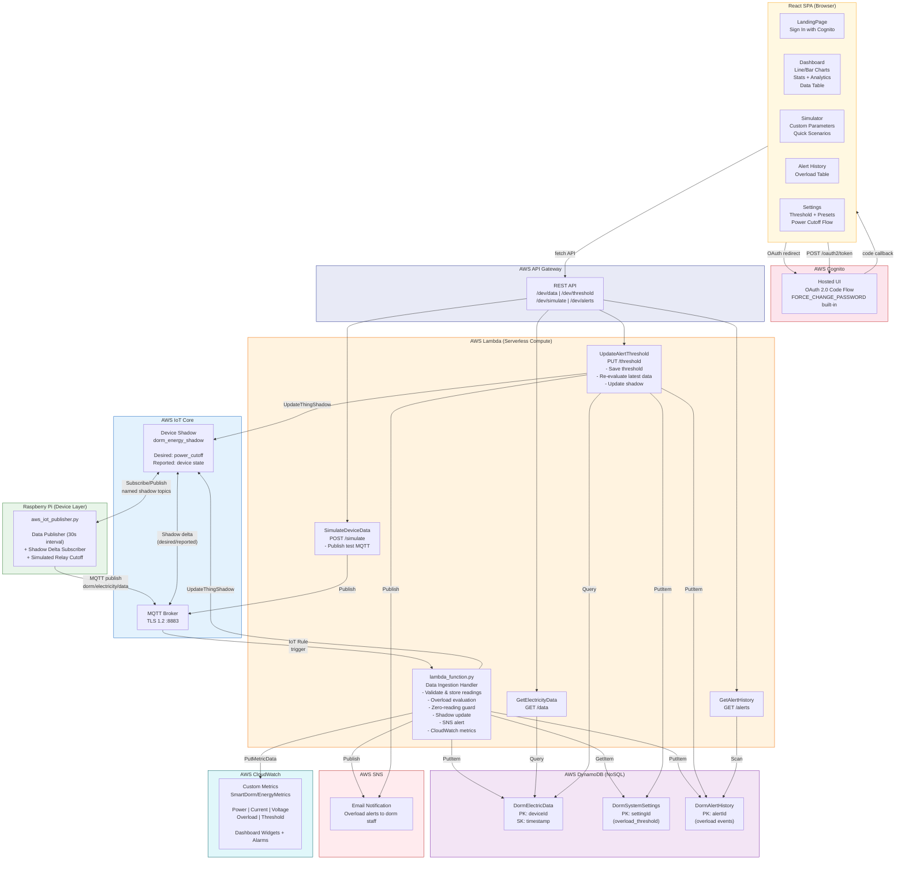

# System Architecture Diagram

→ 访问 https://mermaid.live 粘贴下面代码 → 导出 PNG/PDF

```mermaid
flowchart TB
    subgraph DEVICE["Raspberry Pi (Device Layer)"]
        SCRIPT["aws_iot_publisher.py\n\nData Publisher (30s interval)\n+ Shadow Delta Subscriber\n+ Simulated Relay Cutoff"]
    end

    subgraph IOT["AWS IoT Core"]
        BROKER["MQTT Broker\nTLS 1.2 :8883"]
        SHADOW["Device Shadow\ndorm_energy_shadow\n\nDesired: power_cutoff\nReported: device state"]
    end

    subgraph COMPUTE["AWS Lambda (Serverless Compute)"]
        LAMBDA1["lambda_function.py\nData Ingestion Handler\n- Validate & store readings\n- Overload evaluation\n- Zero-reading guard\n- Shadow update\n- SNS alert\n- CloudWatch metrics"]
        LAMBDA2["GetElectricityData\nGET /data"]
        LAMBDA3["UpdateAlertThreshold\nPUT /threshold\n- Save threshold\n- Re-evaluate latest data\n- Update shadow"]
        LAMBDA4["SimulateDeviceData\nPOST /simulate\n- Publish test MQTT"]
        LAMBDA5["GetAlertHistory\nGET /alerts"]
    end

    subgraph STORAGE["AWS DynamoDB (NoSQL)"]
        DB1["DormElectricData\nPK: deviceId\nSK: timestamp"]
        DB2["DormSystemSettings\nPK: settingId\n(overload_threshold)"]
        DB3["DormAlertHistory\nPK: alertId\n(overload events)"]
    end

    subgraph AUTH["AWS Cognito"]
        COG["Hosted UI\nOAuth 2.0 Code Flow\nFORCE_CHANGE_PASSWORD built-in"]
    end

    subgraph ALERT["AWS SNS"]
        SNS["Email Notification\nOverload alerts to dorm staff"]
    end

    subgraph ANALYTICS["AWS CloudWatch"]
        CW["Custom Metrics\nSmartDorm/EnergyMetrics\n\nPower | Current | Voltage\nOverload | Threshold\n\nDashboard Widgets + Alarms"]
    end

    subgraph API["AWS API Gateway"]
        GW["REST API\n/dev/data | /dev/threshold\n/dev/simulate | /dev/alerts"]
    end

    subgraph FRONTEND["React SPA (Browser)"]
        LANDING["LandingPage\nSign In with Cognito"]
        DASHBOARD["Dashboard\nLine/Bar Charts\nStats + Analytics\nData Table"]
        SIMULATOR["Simulator\nCustom Parameters\nQuick Scenarios"]
        ALERTS["Alert History\nOverload Table"]
        SETTINGS["Settings\nThreshold + Presets\nPower Cutoff Flow"]
    end

    %% Data flow connections
    SCRIPT -->|"MQTT publish\ndorm/electricity/data"| BROKER
    BROKER -->|"IoT Rule\ntrigger"| LAMBDA1
    BROKER <-->|"Shadow delta\n(desired/reported)"| SHADOW
    SHADOW <-->|"Subscribe/Publish\nnamed shadow topics"| SCRIPT

    LAMBDA1 -->|"PutItem"| DB1
    LAMBDA1 -->|"GetItem"| DB2
    LAMBDA1 -->|"PutItem"| DB3
    LAMBDA1 -->|"Publish"| SNS
    LAMBDA1 -->|"PutMetricData"| CW
    LAMBDA1 -->|"UpdateThingShadow"| SHADOW

    GW --> LAMBDA2
    GW --> LAMBDA3
    GW --> LAMBDA4
    GW --> LAMBDA5

    LAMBDA2 -->|"Query"| DB1
    LAMBDA3 -->|"PutItem"| DB2
    LAMBDA3 -->|"Query"| DB1
    LAMBDA3 -->|"UpdateThingShadow"| SHADOW
    LAMBDA3 -->|"Publish"| SNS
    LAMBDA3 -->|"PutItem"| DB3
    LAMBDA4 -->|"Publish"| BROKER
    LAMBDA5 -->|"Scan"| DB3

    FRONTEND -->|"OAuth redirect"| COG
    COG -->|"code callback"| FRONTEND
    FRONTEND -->|"fetch API"| GW
    FRONTEND -->|"POST /oauth2/token"| COG

    style DEVICE fill:#e8f5e9,stroke:#2e7d32
    style IOT fill:#e3f2fd,stroke:#1565c0
    style COMPUTE fill:#fff3e0,stroke:#ef6c00
    style STORAGE fill:#f3e5f5,stroke:#7b1fa2
    style AUTH fill:#fce4ec,stroke:#c62828
    style ALERT fill:#ffebee,stroke:#b71c1c
    style ANALYTICS fill:#e0f7fa,stroke:#006064
    style API fill:#e8eaf6,stroke:#283593
    style FRONTEND fill:#fff8e1,stroke:#f9a825
```
